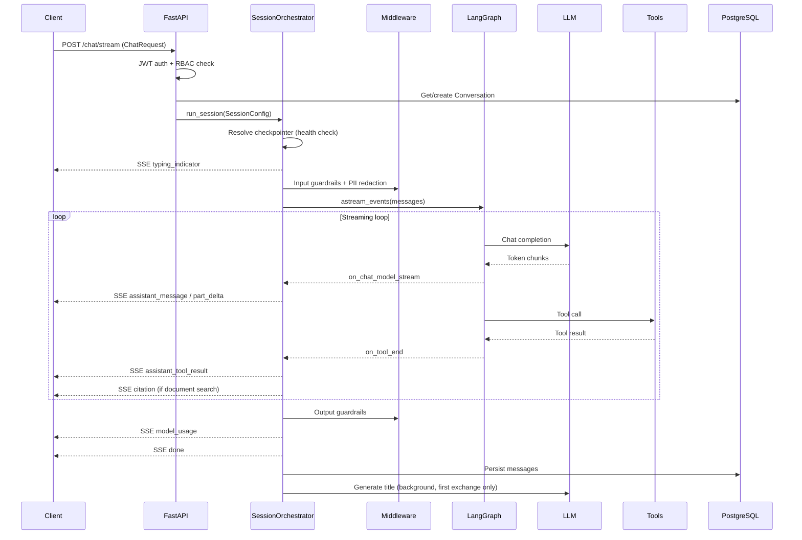

# Chat API Reference

Production-grade chat interaction surface for Cortex-AI. Provides streaming and non-streaming conversation endpoints, conversation lifecycle management, and a rich set of extensions for attachments, search, ratings, export, regeneration, and UI action continuations -- all secured with JWT authentication and project-level RBAC.

---

## Architecture



---

## API Endpoints

All routes are prefixed with `/api/v1` and require a valid JWT token.

### Core Chat

| Method | Path | Auth | Description |
|--------|------|------|-------------|
| `POST` | `/projects/{project_uid}/chat/stream` | `CONVERSATION_CREATE` | Streaming chat via SSE |
| `POST` | `/projects/{project_uid}/chat` | `CONVERSATION_CREATE` | Non-streaming chat (returns full response) |
| `GET` | `/projects/{project_uid}/conversations` | `CONVERSATION_VIEW` | List conversations (paginated) |
| `GET` | `/conversations/{conversation_uid}` | `CONVERSATION_VIEW` | Get conversation with messages |
| `DELETE` | `/conversations/{conversation_uid}` | `CONVERSATION_DELETE` | Delete conversation and all messages |

### Chat Extensions

| Method | Path | Description |
|--------|------|-------------|
| `GET` | `/projects/{project_uid}/conversations/search?q=...` | Full-text search across titles and message content |
| `POST` | `/conversations/{uid}/generate-title` | LLM-generated title from conversation content |
| `PATCH` | `/conversations/{uid}/title` | Manually update conversation title |
| `POST` | `/messages/{uid}/rate` | Rate a message (thumbs up/down with optional feedback) |
| `GET` | `/conversations/{uid}/export?format=json\|markdown` | Export conversation as JSON or Markdown |
| `POST` | `/conversations/{uid}/regenerate` | Delete messages after a user message, prepare for re-stream |
| `POST` | `/conversations/{uid}/stop` | Cancel an in-progress generation |
| `POST` | `/conversations/{uid}/system-event` | Handle UI action continuation (completed/cancelled) |

---

## Chat Request Schema

```json
{
  "message": "How do I deploy a pipeline?",
  "conversation_id": "conv_a1b2c3d4e5f6",
  "stream": true,
  "model": "gpt-4o",
  "context": {
    "referenced_document_id": "doc_xyz"
  },
  "attachments": [
    {
      "id": "doc_abc",
      "name": "architecture.pdf",
      "mime_type": "application/pdf",
      "content": "Extracted text content..."
    }
  ],
  "system_event": {
    "type": "action_completed",
    "capability_id": "create_pipeline",
    "result": { "pipeline_id": "p-123" }
  }
}
```

| Field | Type | Required | Description |
|-------|------|----------|-------------|
| `message` | `string` | Yes | User message (1-10000 chars) |
| `conversation_id` | `string` | No | Existing conversation UID; null creates a new one |
| `stream` | `bool` | No | Enable SSE streaming (default `true`) |
| `model` | `string` | No | Model override (e.g. `gpt-4o`, `claude-sonnet-4`) |
| `context` | `object` | No | Arbitrary key-value context passed to hooks |
| `attachments` | `AttachmentRef[]` | No | Files attached to this message |
| `system_event` | `SystemEventPayload` | No | UI action continuation; replaces `message` when set |

---

## SSE Event Types

When streaming, the server sends events in this format:

```
event: assistant_message
data: {"content": "Here is..."}

event: done
data: {"conversation_id": "conv_xxx", "thread_id": "thread-yyy"}
```

### Event Reference

| Event | Payload | When |
|-------|---------|------|
| `typing_indicator` | `{"status": "thinking"}` | Emitted once at session start |
| `assistant_message` | `{"content": "..."}` | Each streamed token chunk from the LLM |
| `assistant_thought` | `{"content": "..."}` | Internal reasoning (not shown to user by default) |
| `detailed_analysis` | `{"content": "..."}` | ARCHITECT mode analysis output |
| `assistant_tool_request` | `{"tool": "...", "args": {...}}` | LLM requests a tool call |
| `assistant_tool_result` | `{"tool": "...", "result": "..."}` | Tool execution result |
| `citation` | `{"citations": [{"index": 1, "text": "...", "source": "..."}]}` | After document search tool returns results |
| `ui_action` | `{"type": "navigate", ...}` | Suggested UI action for the frontend |
| `ui_action_update` | `{"action_id": "...", "status": "..."}` | Update on a previously emitted UI action |
| `part_start` | `{"part_id": "...", "type": "text"}` | Start of a content part (part streaming mode) |
| `part_delta` | `{"part_id": "...", "delta": "..."}` | Content part chunk |
| `part_end` | `{"part_id": "..."}` | End of a content part |
| `model_usage` | `{"prompt_tokens": N, "completion_tokens": N, ...}` | Aggregated token usage for the session |
| `collect_feedback` | `{"reasons": ["helpful", "inaccurate", ...]}` | Prompt the UI to collect feedback |
| `error` | `{"message": "..."}` | Error during generation |
| `done` | `{"conversation_id": "...", "thread_id": "...", "duration_ms": N}` | Final event; stream closes after this |

---

## SessionOrchestrator Features

The `SessionOrchestrator` is the central entry point for running chat sessions. It is configured via `SessionConfig` dataclass fields:

### Core Features

| Flag | Default | Description |
|------|---------|-------------|
| `streaming` | `true` | Enable SSE streaming to the client |
| `enable_part_streaming` | `false` | Chunk-level part start/delta/end events |
| `mode` | `"standard"` | Agent mode: `standard` or `architect` |
| `use_tools` | `true` | Enable tool calling |
| `use_mcp` | `false` | Load tools from MCP servers |
| `use_swarm` | `false` | Multi-agent swarm with automatic handoffs |
| `use_filesystem` | `false` | Virtual filesystem for agent working memory |
| `use_code_execution` | `false` | Sandboxed code execution tool |
| `use_prompt_caching` | `false` | Provider-specific prompt caching (Anthropic, etc.) |
| `use_summarization` | `false` | Conversation compression middleware |
| `use_skills` | `false` | Progressive skill disclosure via `SKILL.md` files |
| `use_semantic_memory` | `false` | Cross-session semantic memory middleware |
| `max_iterations` | `25` | Maximum LangGraph agent loop iterations |

### Attachments and Continuations

| Flag | Default | Description |
|------|---------|-------------|
| `attachments` | `[]` | File references appended to the user message |
| `system_event` | `null` | UI action continuation; synthesizes a follow-up query |

### Safety and Guardrails

| Flag | Default | Description |
|------|---------|-------------|
| `enable_input_guardrails` | `true` | Block prompt injection, unsafe content, excessive length |
| `enable_output_guardrails` | `true` | Detect system prompt leaks, code injection, PII in responses |
| `guardrail_action` | `"block"` | Action on violation: `block`, `warn`, or `sanitize` |
| `enable_pii_redaction` | `false` | Redact emails, phones, SSNs, credit cards, API keys in messages |
| `pii_entity_types` | `null` | Restrict PII detection to specific types |
| `max_total_tokens` | `0` | Cumulative token limit per session (0 = unlimited) |
| `max_completion_tokens` | `0` | Per-completion token limit (0 = unlimited) |
| `enable_feedback` | `false` | Emit `collect_feedback` SSE event after session |
| `enable_history_dump` | `false` | Dump full conversation to JSONL file (debug mode) |

### Extensibility

| Flag | Default | Description |
|------|---------|-------------|
| `event_hooks` | `[]` | List of `SessionEventHook` instances for lifecycle callbacks |
| `metadata` | `{}` | Arbitrary key-value pairs passed to hooks and logging |

---

## Safety and Guardrails

Cortex-AI includes a layered safety system in `cortex/orchestration/safety/`:

| Component | File | Description |
|-----------|------|-------------|
| **Input Guardrails** | `input_guardrails.py` | Regex + heuristic detection of prompt injection, unsafe content requests, excessive length, and repetition. Raises `GuardrailViolation` on match. |
| **Output Guardrails** | `output_guardrails.py` | Scans LLM responses for system prompt leaks, destructive code injection (shell/SQL/script), and sensitive data. Configurable action: block, warn, or sanitize. |
| **PII Redaction** | `pii_redaction.py` | Middleware that detects and masks emails, phone numbers, SSNs, credit cards, IP addresses, API keys, AWS keys, and JWTs in both user messages and tool I/O. |
| **Token Budget** | `token_budget.py` | Enforces cumulative and per-completion token limits. Raises `TokenBudgetExceeded` when a session exceeds its allocation. |
| **Trace Sanitizer** | `trace_sanitizer.py` | Strips secrets (tokens, passwords, connection strings) from data sent to Langfuse or other observability tools. |
| **Feedback Hook** | `feedback.py` | `SessionEventHook` that emits a `collect_feedback` SSE event with configurable reasons on session completion. |
| **History Dump** | `history_dump.py` | `SessionEventHook` that writes full conversation history to a JSONL file for debugging, with optional PII sanitization. |

Middleware execution order in the agent pipeline:

```
Input Guardrails -> PII Redaction -> Token Budget -> [LLM Call] -> Output Guardrails
```

---

## Data Model

### Conversation

| Column | Type | Description |
|--------|------|-------------|
| `id` | `Integer` | Primary key (auto-increment) |
| `uid` | `String(255)` | Public unique ID (e.g. `conv_a1b2c3d4e5f6`) |
| `project_id` | `FK -> projects.id` | Owning project |
| `principal_id` | `FK -> principals.id` | Creator |
| `thread_id` | `String(255)` | LangGraph thread ID for checkpoint persistence |
| `title` | `String(500)` | Auto-generated or manually set title |
| `meta_json` | `Text` | JSON metadata (model, agent_name, etc.) |
| `created_at` | `DateTime(tz)` | Creation timestamp |
| `updated_at` | `DateTime(tz)` | Last update timestamp |

### Message

| Column | Type | Description |
|--------|------|-------------|
| `id` | `Integer` | Primary key (auto-increment) |
| `uid` | `String(255)` | Public unique ID (e.g. `msg_a1b2c3d4e5f6`) |
| `conversation_id` | `FK -> conversations.id` | Parent conversation (cascade delete) |
| `role` | `String(50)` | `user`, `assistant`, `system`, or `tool` |
| `content` | `Text` | Message text content |
| `tool_calls` | `Text` | JSON: `[{id, name, args}]` |
| `tool_call_id` | `String(255)` | For tool response messages |
| `meta_json` | `Text` | JSON: `{model, tokens, cache_metrics, rating}` |
| `attachments_json` | `Text` | JSON: `[{id, name, mime_type, size_bytes}]` |
| `rating` | `Integer` | `-1` = thumbs down, `0` = neutral, `1` = thumbs up |
| `rating_feedback` | `Text` | Optional text feedback on the rating |
| `created_at` | `DateTime(tz)` | Creation timestamp |

Indexed: `(conversation_id, created_at)` for efficient message retrieval.

---

## Quick Examples

### Streaming Chat

```bash
curl -N -X POST http://localhost:8000/api/v1/projects/proj_abc/chat/stream \
  -H "Authorization: Bearer $TOKEN" \
  -H "Content-Type: application/json" \
  -d '{"message": "Explain Kubernetes pods"}'
```

### Search Conversations

```bash
curl http://localhost:8000/api/v1/projects/proj_abc/conversations/search?q=kubernetes \
  -H "Authorization: Bearer $TOKEN"
```

### Rate a Message

```bash
curl -X POST http://localhost:8000/api/v1/messages/msg_xyz/rate \
  -H "Authorization: Bearer $TOKEN" \
  -H "Content-Type: application/json" \
  -d '{"rating": 1, "feedback": "Very helpful explanation"}'
```

### Export Conversation

```bash
curl http://localhost:8000/api/v1/conversations/conv_abc/export?format=markdown \
  -H "Authorization: Bearer $TOKEN"
```

### Regenerate from a Message

```bash
curl -X POST http://localhost:8000/api/v1/conversations/conv_abc/regenerate \
  -H "Authorization: Bearer $TOKEN" \
  -H "Content-Type: application/json" \
  -d '{"from_message_id": "msg_xyz"}'
```

### Stop Generation

```bash
curl -X POST http://localhost:8000/api/v1/conversations/conv_abc/stop \
  -H "Authorization: Bearer $TOKEN"
```
